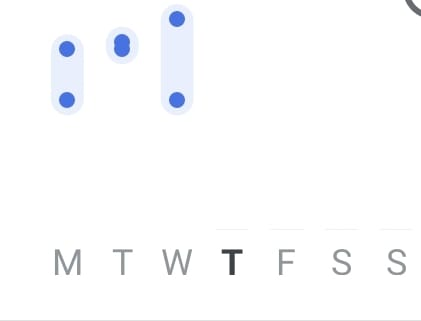

# MPCHART_RENDERER
This repository Contains file Related To MP_Chart Rendere

#To Use Combied Chart Renderer

```
private fun submitTwoPointChart(dataList: List<CandleEntry>?) {
        val twoPointChart = binding.bpChart
        val setLine = getLineDataMax(dataList)
        val dataSet = CandleDataSet(dataList, "Data Set")
        dataSet.setDrawIcons(false)
        dataSet.setDrawValues(false)
        dataSet.axisDependency = YAxis.AxisDependency.LEFT
        dataSet.barSpace = 0.2f
        dataSet.shadowColor = Color.TRANSPARENT
        dataSet.shadowWidth = 0.1f
        dataSet.decreasingColor = ContextCompat.getColor(
            requireContext(),
            R.color.color_of_your_choice
        )
        dataSet.isHighlightEnabled = true // allow highlighting for DataSet

        // set this to false to disable the drawing of highlight indicator (lines)
        dataSet.setDrawHighlightIndicators(true)
        dataSet.highLightColor = Color.BLACK
        dataSet.decreasingPaintStyle = Paint.Style.FILL
        dataSet.increasingColor = ContextCompat.getColor(
            requireContext(),
            R.color.color_of_your_choice
        )
        dataSet.increasingPaintStyle = Paint.Style.FILL
        dataSet.neutralColor =
            ContextCompat.getColor(requireContext(), R.color.color_of_your_choice)
        dataSet.axisDependency = YAxis.AxisDependency.LEFT

        twoPointChart.apply {
            setBackgroundColor(Color.WHITE)
            description.isEnabled = false
            setMaxVisibleValueCount(7)
            setPinchZoom(false)
            setDrawGridBackground(false)
            setScaleEnabled(false)
            isDoubleTapToZoomEnabled = false
            isScaleYEnabled = false
            setTouchEnabled(false)
            renderer = MyCombinedChartRenderer(
                this,
                animator,
                viewPortHandler
            )
            xAxis.position = XAxis.XAxisPosition.BOTTOM
            xAxis.setDrawAxisLine(false)
            xAxis.setDrawGridLines(false)
            xAxis.spaceMin = 0.5f
            xAxis.spaceMax = 0.5f
            xAxis.textSize = 12f
            xAxis.textColor = requireContext().getColor(R.color.newTextColor)
            xAxis.valueFormatter = MyXAxisFormatter()
            axisRight.isEnabled = false
            val leftAxis = axisLeft
            leftAxis.textColor = Color.TRANSPARENT
            leftAxis.axisMinimum = 0f
            leftAxis.removeAllLimitLines() // reset all limit lines to avoid overlapping lines
            leftAxis.setLabelCount(6, true)
            //leftAxis.setYOffset(20f);
            leftAxis.setDrawAxisLine(false)
            leftAxis.setDrawZeroLine(false)
            leftAxis.setDrawLabels(true)
            leftAxis.setDrawGridLines(false)

            post {
                data = CombinedData()
                setChartData(CandleData(dataSet), setLine)
            }
        }
    }

    private fun getLineDataMax(barData: List<CandleEntry>?): LineData {
        val highList = ArrayList<Entry>()
        val lowList = ArrayList<Entry>()
        val zeroList = ArrayList<Entry>()
        barData?.forEach {
            Timber.e("${it.high}, ${it.low}")
            if (it.high != 0f && it.low != 0f) {
                highList.add(Entry(it.x, it.high))
                lowList.add(Entry(it.x, it.low))
            } else {
                zeroList.add(Entry(it.x, 0f))
            }
        }
        return getSet(highList, lowList, zeroList)
    }

    private fun getSet(
        valuesBaselineHigh: ArrayList<Entry>,
        valuesBaselineLow: ArrayList<Entry>,
        valuesBaselineZero: ArrayList<Entry>,
    ): LineData {

        val baselineDataSets: ArrayList<ILineDataSet> = ArrayList()
        val setZero = LineDataSet(valuesBaselineZero, "")
        setZero.setDrawIcons(false)
        setZero.color = Color.TRANSPARENT
        setZero.setDrawCircles(true)
        setZero.setDrawCircleHole(false)
        setZero.setDrawFilled(true)
        setZero.formLineWidth = 0f
        setZero.setDrawValues(false)
        setZero.fillAlpha = 255
        setZero.fillColor = Color.WHITE
        setZero.setCircleColor(Color.TRANSPARENT)
        baselineDataSets.add(setZero)
        val setHigh = LineDataSet(valuesBaselineHigh, "")
        setHigh.setDrawIcons(false)
        setHigh.color = Color.TRANSPARENT
        setHigh.setDrawCircles(true)
        setHigh.setDrawCircleHole(false)
        setHigh.setDrawFilled(true)
        setHigh.formLineWidth = 0f
        setHigh.setDrawValues(false)
        setHigh.fillAlpha = 255
        setHigh.fillColor = Color.WHITE
        setHigh.setCircleColor(
            ContextCompat.getColor(
                requireContext(),
                R.color.blood_pressure_blue
            )
        )
        baselineDataSets.add(setHigh)
        val setLow = LineDataSet(valuesBaselineLow, "")
        setLow.setDrawIcons(false)
        setLow.color = Color.TRANSPARENT
        setLow.setDrawCircles(true)
        setLow.setDrawCircleHole(false)
        setLow.formLineWidth = 1f
        setLow.setDrawValues(false)
        setLow.setDrawFilled(true)
        setLow.fillAlpha = 255
        setLow.fillColor = Color.WHITE
        setLow.setCircleColor(ContextCompat.getColor(requireContext(), R.color.color_of_your_choice))
        baselineDataSets.add(setLow)

        val data = LineData(baselineDataSets)
        data.isHighlightEnabled = false
        return data
    }

    private fun setChartData(set1: CandleData, setLine: LineData) {
        binding.bpChart.apply {
            resetTracking()
            val barData = CombinedData()
            barData.setData(set1)
            barData.setData(setLine)
            data = barData
            setXAxisRenderer(ColoredLabelXAxisRenderer(
                viewPortHandler, xAxis, getTransformer(
                    YAxis.AxisDependency.LEFT),requireContext()))
            setBackgroundColor(Color.TRANSPARENT)
            legend.isEnabled = false
            invalidate()
        }
    }
```


Example of Two Point Chart



Two Highlight a particular point on the X Axis Use 

**ColoredLabelXAxisRenderer**

and consume it in Java as

```
mChart.setXAxisRenderer(new ColoredLabelXAxisRenderer(mChart.getViewPortHandler(), mChart.getXAxis(), mChart.getTransformer(AxisDependency.LEFT), colors))
```

and in Kotlin as

```
binding.bpChart.apply {
            setXAxisRenderer(ColoredLabelXAxisRenderer(
                viewPortHandler, xAxis, getTransformer(
                    YAxis.AxisDependency.LEFT),requireContext()))
            
        }
```
